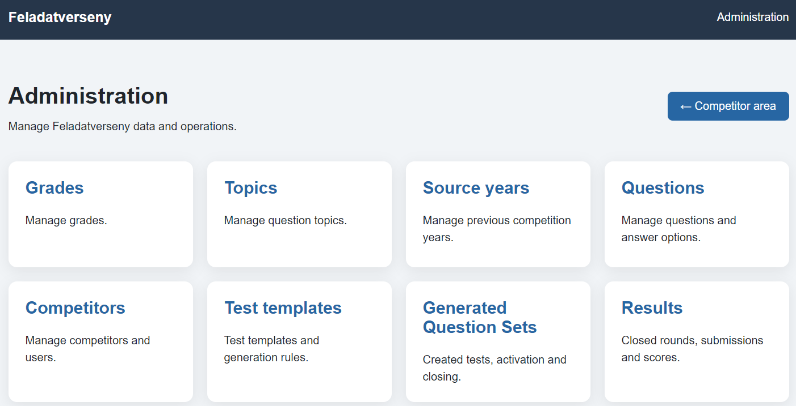
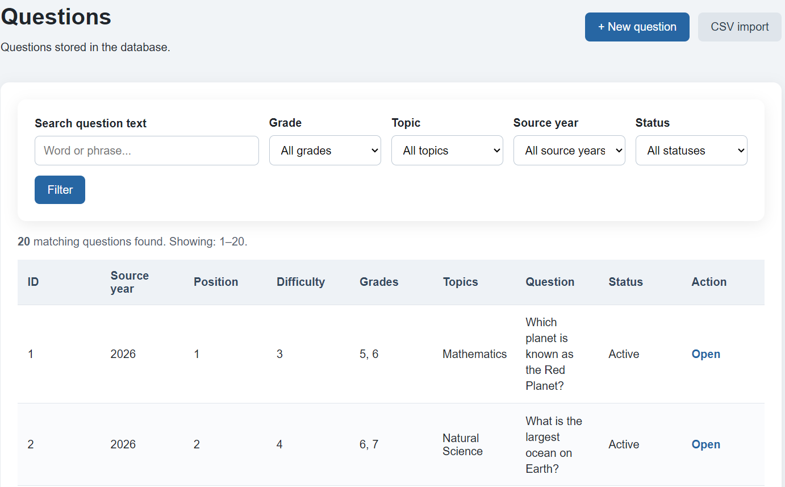
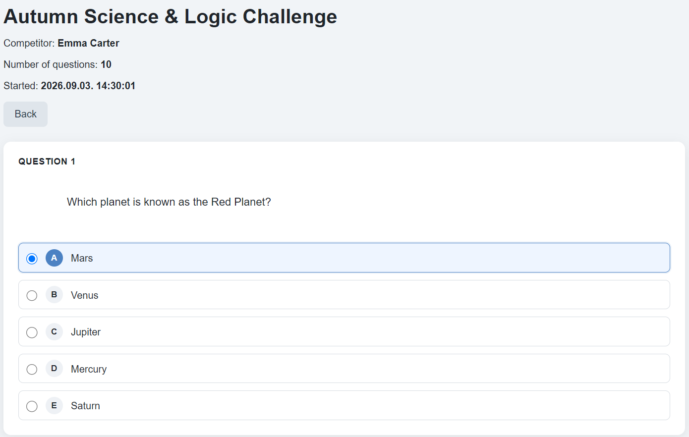
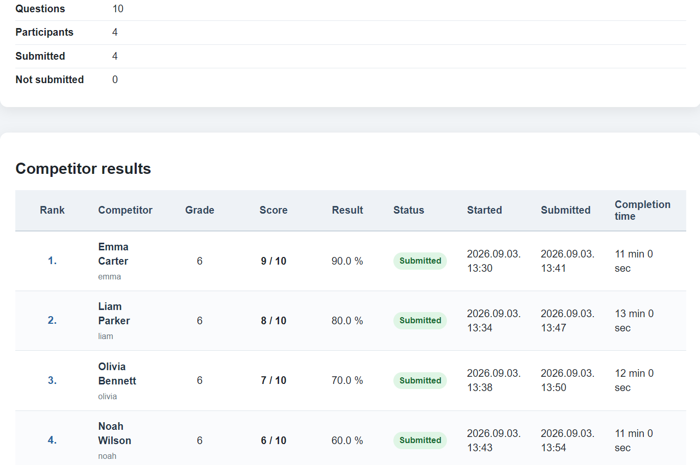
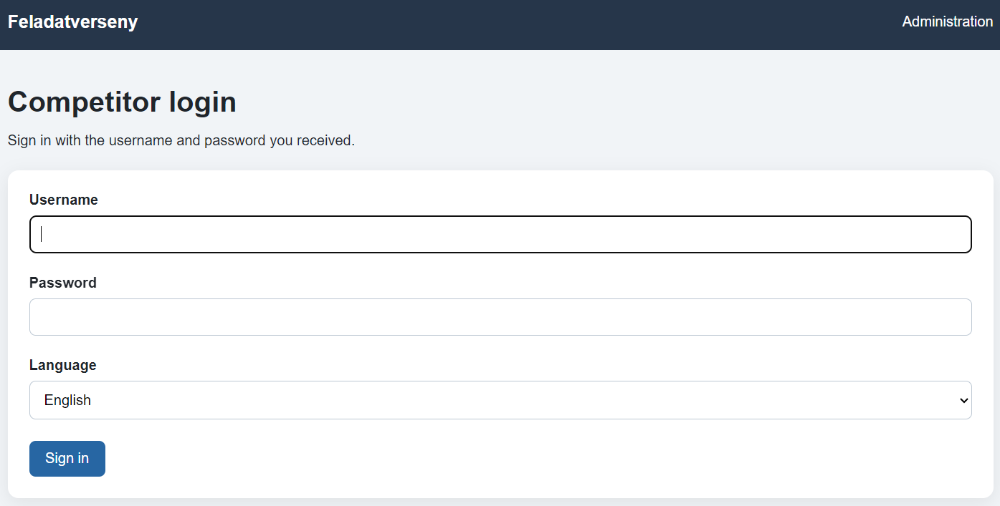

# Feladatverseny

Self-hosted web platform for creating and running school question competitions.

Feladatverseny helps schools, teachers and organizers build reusable question
banks, generate competition rounds, manage competitors and review detailed
results from a browser.

The application is designed for self-hosting on Ubuntu Linux and includes
automated installation, PostgreSQL database setup, systemd services, backups,
health checks and bilingual Hungarian/English user interfaces.

## Features

### Question bank

- Create and edit questions from the browser
- Organize questions by grade, topic and source year
- Add multiple-choice answers and explanations
- Upload images for individual questions
- Import questions in bulk from CSV
- Activate or deactivate questions without deleting them

### Competition management

- Create reusable test templates
- Generate competition tests from the question bank
- Control generated test lifecycle
- Activate, close or return tests to draft state
- Review generated test contents before use

### Competitors

- Create and manage competitor accounts
- Assign preferred interface language
- Hungarian and English user interface
- Competitor dashboard
- Browser-based test completion

### Results

- Automatic scoring
- Detailed result overview
- Per-competitor result pages
- Per-question answer review
- Correct, incorrect and unanswered answer indicators
- Completion-time tracking
- Ranking and aggregate result information

### Self-hosting

- Automated Ubuntu installer
- PostgreSQL database provisioning
- Flask database migrations
- Gunicorn production service
- systemd application service
- Automated backup timer
- PostgreSQL and application backups
- Backup retention
- Health endpoint
- URL-prefix deployment support
- Tailscale Serve compatible deployment

## Screenshots

All screenshots below use synthetic demo data. No real competitors,
questions, results, private addresses or credentials are included.

### Administration

The administration dashboard provides access to grades, topics, source
years, questions, competitors, test templates, generated question sets
and results.

### Question bank

Questions can be searched and filtered by grade, topic, source year and
status. The interface supports Hungarian and English, including localized
topic names.

### Competition interface

Competitors receive a clean browser-based test interface with randomized
questions and answer options.

### Results

Closed competitions provide ranking, score, completion status and timing
information for each competitor.

### Login and language selection

The login screen allows competitors to select Hungarian or English.

## Quick start

Clone the repository as a normal user:

    cd /opt

    git clone https://github.com/rigzoltan83/feladatverseny.git

    cd /opt/feladatverseny

Run the installer as root:

    sudo /opt/feladatverseny/deploy/install.sh

The installer creates the application environment, PostgreSQL database,
initial administrator account, systemd services and first backup.

## Custom port

The application listens only on localhost by default.

To install on port `5080`:

    sudo APP_PORT=5080 /opt/feladatverseny/deploy/install.sh

This produces:

    APP_BIND=127.0.0.1:5080

## Subpath deployment

Feladatverseny can run below a URL prefix such as:

    /feladatverseny

Example:

    sudo APP_PORT=5080 APPLICATION_PREFIX=/feladatverseny /opt/feladatverseny/deploy/install.sh

This is useful behind reverse proxies and Tailscale Serve.

## Tailscale Serve

For an installation using:

    APP_BIND=127.0.0.1:5080
    APPLICATION_PREFIX=/feladatverseny

the application can be published to a tailnet with:

    sudo tailscale serve --bg --set-path /feladatverseny http://127.0.0.1:5080

Feladatverseny itself does not need to listen directly on the LAN interface.

## Architecture

Feladatverseny uses a traditional server-rendered web architecture.

Core components:

- Python
- Flask
- Flask-SQLAlchemy
- Flask-Migrate
- Flask-Babel
- PostgreSQL
- Gunicorn
- systemd
- Jinja templates

Persistent application media is stored separately from the source tree.

Default paths:

    Application:  /opt/feladatverseny
    Media:        /srv/feladatverseny/media
    Backups:      /backup/feladatverseny
    Configuration:/opt/feladatverseny/.env

## Localization

The application supports:

- Hungarian
- English

Language preference can be selected by users and is persisted for authenticated
competitors and administrators.

The technical project documentation is maintained in English.

## Health check

The application exposes:

    /health

Example:

    curl http://127.0.0.1:5080/health

A healthy deployment reports both application and database status as `ok`.

## Backups

Feladatverseny includes automatic PostgreSQL and application backups.

By default:

- backups run daily
- backups are stored under `/backup/feladatverseny`
- backups older than 72 hours are removed automatically
- backup files use root-only permissions

Backups contain application secrets and must never be published.

See:

- [Backup and recovery](docs/BACKUP.md)
- [Updating](docs/UPDATE.md)

## Installation documentation

For detailed deployment information, see:

- [Installation guide](docs/INSTALL.md)
- [Documentation index](docs/README.md)

## Public releases

Public releases use a sanitized installation seed.

The public seed must not contain:

- real competitors
- real administrator accounts
- real competition questions
- private test templates
- generated competitions
- submissions
- attempts
- scores or results
- uploaded private images
- organization-specific private information

The production database is never modified merely to prepare a public release.

See the mandatory:

- [Public release checklist](docs/RELEASE.md)

## Updating

Existing installations should be backed up before updating.

See:

- [Update guide](docs/UPDATE.md)

## Changelog

See:

- [CHANGELOG.md](CHANGELOG.md)

## Status

Feladatverseny is currently being prepared for its first public release.

The current repository should be considered pre-release software until the
public release checklist has been completed.

## License

A license will be selected before the first public release.

Until a license is added, no additional permissions are granted beyond those
provided by applicable copyright law.
